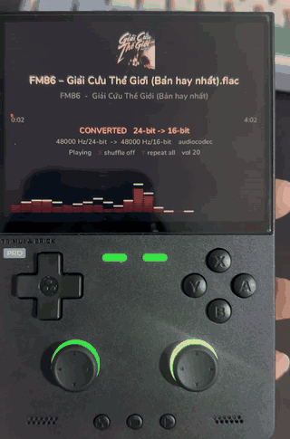
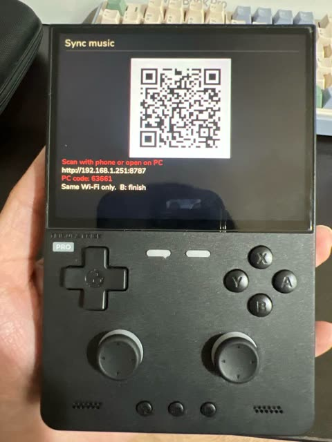

# Truepod

A bit-perfect music player for the **TrimUI Brick Pro**.

*[Tiếng Việt](README.vi.md)*

  
  

Every other player on this handheld gives something up. Some cap the output at
44.1 kHz or 16-bit, others resample everything to 48 kHz. The side buttons cannot
turn a USB DAC up or down. Playback stutters, skips, or jumps to the next song.
And the screen has to stay on for the music to keep going, which empties the
battery.

Truepod fixes all of that:

- **Full quality.** It plays the file at its own sample rate and bit depth, and
  tells you when it could not.
- **The side buttons control the DAC.** The volume keys turn a USB DAC up and
  down without costing any quality. A DAC without its own volume keeps its own
  buttons.
- **No stutters, no skipped songs.** Pausing or replugging the DAC never skips
  to the next song.
- **Screen off, music on.** Turn the screen off to save battery while the
  music keeps playing.

## Download

Pick the build for your firmware from **[the latest release](../../releases/latest)**:

| Firmware | File |
|---|---|
| spruceOS | `Truepod-<version>-spruceOS.zip` |
| stock TrimUI | `Truepod-<version>-stockOS.zip` |

Same player in both. They differ only in which directory the firmware looks in.

## Install

1. Unzip onto the root of the SD card, and merge the folder when asked. The zip
   already carries the right one for your firmware: `App/Truepod` for spruceOS,
   `Apps/Truepod` for stock TrimUI.
2. Put music in `/mnt/SDCARD/MEDIA`. Subfolders are how you browse it.
3. Boot the device and open **Truepod**.

## Guide

| Button | Library | Now playing |
|---|---|---|
| D-pad up/down | move the selection | — |
| A | open folder, or play | play / pause |
| B | up one folder | back to the library |
| X | delete the track (asks first) | shuffle on / off |
| Y | Wi-Fi upload | repeat all / one / off |
| L1 / R1 | page up / down | previous / next track |
| L2 / R2 | — | seek 10 seconds |
| START | go to Now Playing | back to the library |

These work on any screen: **SELECT** opens Options, **MENU** quits, the **right
stick click** turns the screen off with the music still playing, and the side
buttons are volume.

To add music without a card reader, press **Y** in the library and scan the QR
code from a phone on the same network.

## Features

✅ in Free, ❌ means it is planned for **Truepod Pro**, which is not released yet.
Free is frozen at what it has now: bug fixes, not new features.

| | Free | Pro |
|---|:---:|:---:|
| Hi-res: 24-bit and high sample rates, tested to 88.2 kHz | ✅ | ✅ |
| Bit-perfect through a USB DAC on the top port | ✅ | ✅ |
| FLAC, MP3, WAV, OGG, Opus, M4A / AAC / ALAC | ✅ | ✅ |
| BIT-PERFECT / CONVERTED read from the sound card | ✅ | ✅ |
| Folder browsing with each track's real rate and bit depth, cover art, delete | ✅ | ✅ |
| Shuffle, repeat all / one / off | ✅ | ✅ |
| Wi-Fi upload from a QR code | ✅ | ✅ |
| Spectrum display, LEDs flashing to the beat | ✅ | ✅ |
| Screen off with the music still playing | ✅ | ✅ |
| spruceOS and stock TrimUI firmware | ✅ | ✅ |
| Browse by artist and album, search, saved `.m3u` playlists | ❌ | ✅ |
| Favourites, an editable queue, per-track resume | ❌ | ✅ |
| Gapless, EQ | ❌ | ✅ |
| Sync and stream music from Telegram, Spotify, SoundCloud and more | ❌ | ✅ |
| Stream from your own music server (Navidrome and other Subsonic servers), bit-perfect | ❌ | ✅ |
| Use the bottom USB port for a DAC | ❌ | ✅ |
| Updates over the air | ❌ | ✅ |
| A choice of screen layouts, more LED modes | ❌ | ✅ |
| Sleep timer | ❌ | ✅ |
| Vietnamese interface | ❌ | ✅ |

## Reporting a problem

[Open an issue on GitHub](https://github.com/duyquang6/truepod/issues/new?template=bug_report.yml) with your firmware, the version, and `truepod.log` from the app
folder on the card. Its first lines say what your firmware provides, which
usually explains a difference between two devices straight away.

---

Releases and documentation only; the source is not public. Truepod is
proprietary — see [LICENSE](LICENSE).
